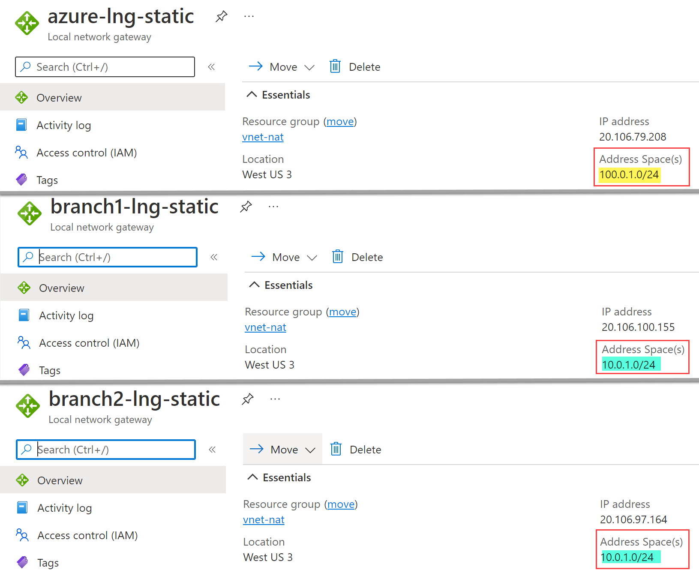
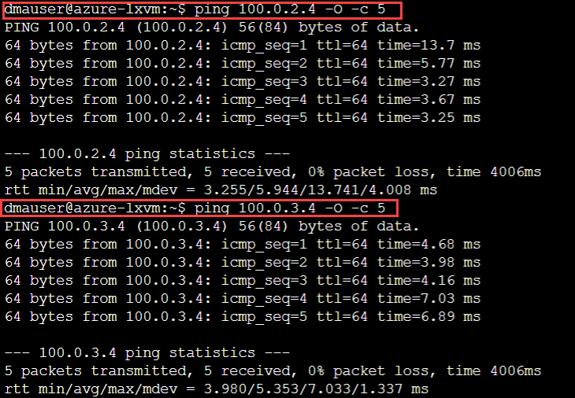

# NAT on Azure VPN Gateways (Lab)

## Intro

This Lab helps you deploy configure NAT by using the same scenario covered over the official article [How to configure NAT on Azure VPN Gateways](https://docs.microsoft.com/en-us/azure/vpn-gateway/nat-howto). Please, review that article to get a good understanding of the scenario and use this lab to practice on a real lab environment.

Here is the network topology used in this lab:


## Components

This lab deploys Azure side and two branches using the same configuration stated on the official article but include also few VMs to test the connectivity.

- **Azure** 
    - azure-vnet - Address space 10.0.1.0/24
    - azure-lxvm - Linux virtual machine
    - azure-vpngw - Azure VPN Gateway using VpnGw2 SKU (required to use NAT feature)
    - NAT address - 100.0.1.0/24
- **Branch1**
    - branch1-vnet - Address space 10.0.1.0/24
    - branch1-lxvm - Linux virtual machine
    - branch1-vpngw - Azure VPN Gateway using VpnGw1 SKU
    - NAT address - 100.0.2.0/24
- **Branch2**
    - branch2-vnet - Address space 10.0.1.0/24
    - branch2-lxvm - Linux virtual machine
    - branch1-vpngw - Azure VPN Gateway using VpnGw1 SKU
    - NAT address - 100.0.2.0/24

- Note: all the VMs do not have Public IP but you can access them using serial console.

## Deploy Lab

[](https://portal.azure.com/#create/Microsoft.Template/uri/https%3A%2F%2Fraw.githubusercontent.com%2Fdmauser%2Fazure-vpn-s2s-nat%2Fmain%2Fazuredeploy.json)
[](http://armviz.io/#/?load=https%3A%2F%2Fraw.githubusercontent.com%2Fdmauser%2Fazure-vpn-s2s-nat%2Fmain%2Fazuredeploy.json)

The lab takes between 15-25 minutes to get provisioned.

### Scenario 1: Static NAT and S2S using static routing

#### Prerequisites

```bash
az login
#List all your subscriptions
az account list -o table --query "[].{Name:name, IsDefault:isDefault}"
#List default Subscription being used
az account list --query "[?isDefault == \`true\`].{Name:name, IsDefault:isDefault}" -o table

# In case you want to do it separated Subscription change your active subscription as shown
az account set --subscription <Add here SubID or Name> #Add your Subscription ID or Name

#Parameters (change based based on your needs)
rg=vnet-nat #Set the resource group where your lab got deployed
azurenatrange='100.0.1.0/24' #NAT range used by Azure
branch1natrange='100.0.2.0/24' #NAT range used by Branch1
branch2natrange='100.0.3.0/24' #NAT range used by Branch2

#Variables
azurevnetrange=$(az network vnet show -n azure-vnet -g $rg --query addressSpace.addressPrefixes[0] -o tsv)
branch1vnetrange=$(az network vnet show -n branch1-vnet -g $rg --query addressSpace.addressPrefixes[0] -o tsv)
branch2vnetrange=$(az network vnet show -n branch2-vnet -g $rg --query addressSpace.addressPrefixes[0] -o tsv)
location=$(az group show -g $rg --query location  -o tsv)
sharedkey=$(openssl rand -base64 24)
```

#### Create Local Network Gateways

```bash
#Azure
az network local-gateway create \
--gateway-ip-address $(az network public-ip show --name azure-vpngw-pip1 --resource-group $rg -o tsv --query "ipAddress" -o tsv) \
--name azure-lng-static \
--resource-group $rg \
--local-address-prefixes $azurenatrange \
--output none

#Branch1
az network local-gateway create \
--gateway-ip-address $(az network public-ip show --name branch1-vpngw-pip1 --resource-group $rg -o tsv --query "ipAddress" -o tsv) \
--name branch1-lng-static \
--resource-group $rg \
--local-address-prefixes $branch1vnetrange \
--output none

#Branch2
az network local-gateway create \
--gateway-ip-address $(az network public-ip show --name branch2-vpngw-pip1 --resource-group $rg -o tsv --query "ipAddress" -o tsv) \
--name branch2-lng-static \
--resource-group $rg \
--local-address-prefixes $branch2vnetrange \
--output none
```

Review all three Local Network Gateways. For this solution both Branch1 and Branch2 use 10.0.1.0/24 while Azure uses 100.0.1.0/24 (NAT address). Branches need to see Azure as different address space because they are not using any NAT rule. NAT rules Ingress and Egress are configured on Azure side only:



#### Create NAT Rules

You will see below that NAT rules are only associated to the azure-vpngw side.

```bash
#Egress NAT Rule from Azure to Branches
az network vnet-gateway nat-rule add \
--name azure \
--type Static \
--mode EgressSnat \
--internal-mappings $azurevnetrange \
--external-mappings $azurenatrange \
--gateway-name azure-vpngw \
--resource-group $rg \
--output none

#Ingress NAT Rule from Branch1 to Azure
az network vnet-gateway nat-rule add \
--name branch1 \
--type Static \
--mode IngressSnat \
--internal-mappings $branch1vnetrange \
--external-mappings $branch1natrange \
--gateway-name azure-vpngw \
--resource-group $rg \
--output none

#Ingress NAT Rule from Branch2 to Azure
az network vnet-gateway nat-rule add \
--name branch2 \
--type Static \
--mode IngressSnat \
--internal-mappings $branch2vnetrange \
--external-mappings $branch2natrange \
--gateway-name azure-vpngw \
--resource-group $rg \
--output none
```

You can review the generated NAT rules over the Portal by accessing azure-vpngw blade and go to NAT Rules. You should have the following rules listed there:


#### Create VPN connections

```bash
#Parse NAT rules as variables
natazure=$(az network vnet-gateway nat-rule list -g $rg --gateway-name azure-vpngw --query "[?name=='azure'].{id:id}" -o tsv)
natbranch1=$(az network vnet-gateway nat-rule list -g $rg --gateway-name azure-vpngw --query "[?name=='branch1'].{id:id}" -o tsv)
natbranch2=$(az network vnet-gateway nat-rule list -g $rg --gateway-name azure-vpngw --query "[?name=='branch2'].{id:id}" -o tsv)

## Azure to Branch1 and Branch 2 and associate NAT Rules
# Azure to Branch1
az network vpn-connection create \
--name azure-to-branch1 \
--resource-group $rg \
--vnet-gateway1 azure-vpngw \
--location $location \
--shared-key $sharedkey \
--local-gateway2 branch1-lng-static \
--ingress-nat-rule $natbranch1 \
--egress-nat-rule $natazure \
--output none

# Azure to Branch2
az network vpn-connection create \
--name azure-to-branch2 \
--resource-group $rg \
--vnet-gateway1 azure-vpngw \
--location $location \
--shared-key $sharedkey \
--local-gateway2 branch2-lng-static \
--ingress-nat-rule $natbranch2 \
--egress-nat-rule $natazure \
--output none

# Branch 1 to Azure
az network vpn-connection create \
--name branch1-to-azure \
--resource-group $rg \
--vnet-gateway1 branch1-vpngw \
--location $location \
--shared-key $sharedkey \
--local-gateway2 azure-lng-static \
--output none

# Branch 2 to Azure
az network vpn-connection create \
--name branch2-to-azure \
--resource-group $rg \
--vnet-gateway1 branch2-vpngw \
--location $location \
--shared-key $sharedkey \
--local-gateway2 azure-lng-static \
--output none
```

#### Connectivity test

- Step 1: Open serial console on azure-lxvm, branch1-lxvm and branch2-lxvm

- Step 2: On the branch1-lxvm and branch2-lxvm leave the following command running:
```bash
sudo tcpdump -ni any icmp
```
- Step 3: On the azure-lxvm run the following commands:
```bash
ping 100.0.2.4 -O -c 5
ping 100.0.3.4 -O -c 5
```
- Expected outputs:
    - azure-lxvm:
    
    - branch1-lxvm:
    
    - branch2-lxvm:
    

### Scenario 2: Static NAT and S2S using dynamic (BGP) routing

Coming soon.